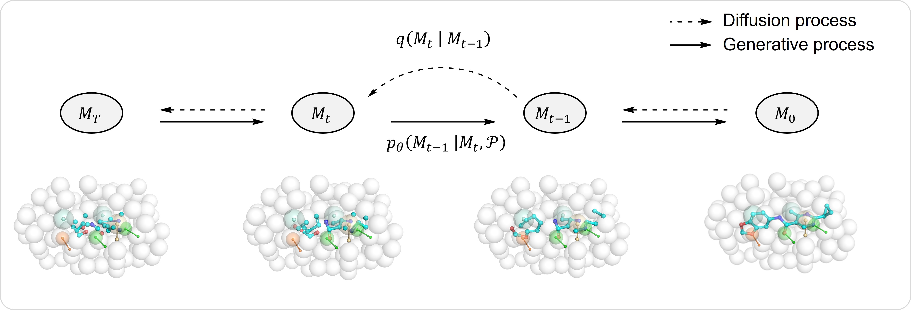

<h1 align="center">  PhoreGen  </h1>
<h2 align="center"> Pharmacophore-Oriented 3D Molecular Generation towards Efficient Feature-Customized Drug Discovery </h2>

[](https://pytorch.org/)

[](https://github.com/ppjian19/PhoreGen/blob/main/LICENSE)

[PhoreGen](https://phoregen.ddtmlab.org) is a pharmacophore-oriented 3D molecular generation framework designed to generate entire 3D molecules that are precisely aligned with a given pharmacophore model. It employs asynchronous perturbations and simultaneously updates on both atomic and bond information, coupled with a message-passing mechanism that incoporates prior knowledge of ligand-pharmacophore mapping during the diffusion-denoising process. By hierarchical learning on a large number of ligand-pharmacophore pairs derived from 3D ligands, complex structures, and docking-produced potential binding modes, PhoreGen can generate chemically and energetically reasonable 3D molecules well-aligned with the pharmacophore constraints, while maintaining structural diversity, drug-likeness, and potentially high binding affinity. Notably, it excels in generating feature-customized molecules, e.g. with covalent groups and metal-binding motifs, at high frequency, demonstrating its unparalleled ability and practicality even for challenging drug design scenarios.




## Installation
### Dependency
The codes have been tested in the following environment:
Package  | Version
--- | ---
Python | 3.9.16
PyTorch | 1.12.1
CUDA | 12.1
PyTorch Geometric | 2.1.0 
RDKit | 2022.9.5
OpenBabel | 3.1.1
Pandas | 1.5.3
NumPy | 1.25.1
### Install via conda yaml file
```bash
conda env create -f phoregen_env.yml
conda activate phoregen
```


## Datasets

Please refer to [`README.md`](./data/README.md) in the `data` folder.

## Sampling

### Preparing pharmacophore models
You can generate pharmacophore models based on complexes or ligands using the online tool available at [AncPhore](https://ancphore.ddtmlab.org/Model).

### Generating molecules
Use the following command to generate molecules based on the given pharmacophore models:
```bash
python sample_all.py --num_samples 100 --outdir ./results/test --phore_file_list ./data/phore_for_sampling/file_index.json
```
Key arguments:
- `num_samples`: Number of molecules to generate for each pharmacophore model.
- `outdir`: Output directory for the generated molecules.
- `phore_file_list`: Path to the JSON file containing the list of pharmacophore models, we provide a test file in `./data/phore_for_sampling/file_index.json`.

Output files include 3D molecular structures in `.sdf` format.


## Training

### Pre-training
To perform pretraining with the LigPhore dataset:
```bash
python train.py --config ./configs/train_lig-phore.yml
```

### Fine-Tuning
To refine the model using CpxPhore and DockPhore datasets:
```bash
python train.py --config ./configs/train_dock-cpx-phore.yml
```


## 📩Contact

For questions or feedback, please contact:
- **Peng Jian**: ppjian19@163.com
- **Li Guo-Bo**: liguobo@scu.edu.cn
- Visit our [Lab Website](https://ddtmlab.org) for more details about PhoreGen and related projects.
